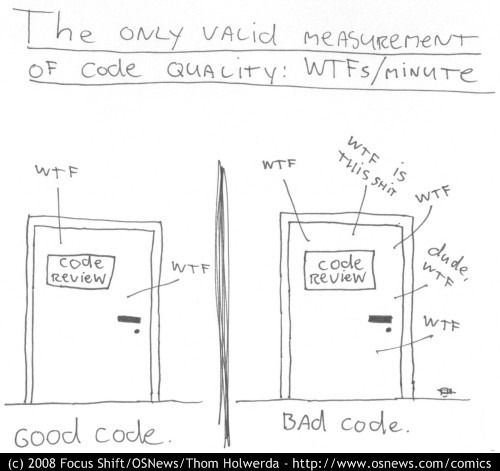

# Code Quality, meh?!

Christophe Philemotte, Lyon.rb, 18 June 2014

---

## About me

* Developer ([@toch on GitHub](https://github.com/toch), [@_toch on Twitter](https://twitter.com/_toch))
* Author on [blog.8thcolor.com](http://blog.8thcolor.com)
* CoFounder of PullReview [https://pullreview.com](https://pullreview.com)

---

---

> I hope to see Ruby help every programmer in the world to be productive, and to
> enjoy programming, and to be happy. That is the primary purpose of Ruby
> language.
> **Matz, 2008**

---

> Code is like farts. It stinks if it isn't yours.

---

---

---

---

---

---

### For Developer

* productivity / time
* confidence

---

### For Company

* money
* confidence

---

### 2 Aspects

* Functional
* Structural

---

### Functional

How it complies to the:

* user stories
* specs
* functionalities
* requirements

---

### Structural

* Reliability
* Efficiency
* Security
* Maintainability
* Size

---

### How to check them?

---

---

* Tests
* &nbsp;
* &nbsp;

---

* Tests
* Code Review
* &nbsp;

---

* Tests
* Code Review
* Static Analysis

---

### How to start?

---

# Thanks! Questions?
